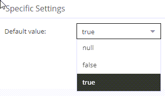

# Other Datatypes

## Checkbox



A checkbox field can be configured to be checked by default when a new object is created. This can be achieved by 
checking `Default value` in the object field settings. In the UI a checkbox is displayed as a simple checkbox. 

It is stored in a TINYINT column in the database with the value 0 or 1. 

In order to set a checkbox value, a bool value needs to be passed to the according setter of the object:

```php
$object->setCheckbox(true);
```

## Boolean Select

A `Boolean Select` is kind of a tri-state checkbox which is rendered as a select datatype in the admin UI.
The background is that a checkbox can only have two states. This is especially important when it comes to inheritance.
A checkbox treats an empty (never set) value just like the unchecked value. The consequence is then as soon as a parent sets it `checked` you can not reset it to `unchecked` in the child nodes anymore.
The boolean select takes care of this problem by introducing a third state. The storage values are -1 (for unchecked), 1 (for checked and
null for empty.
For the admin UI you can specify the display values according to your needs. Default values are `yes`, `no` and `empty`.


## Link 


In the UI a link is displayed as text. Its details can be edited by clicking on the button next to the link text. In the 
object class definition there are no special configurations available for an object field link.

The link object field has its own data class which is `Pimcore\Model\DataObject\Data\Link`. In order to set a link 
programmatically an `Pimcore\Model\DataObject\Data\Link` object needs to be instantiated and passed to the setter:

```php
$l = new DataObject\Data\Link();               
$l->setPath("http://www.pimcore.org");    
$l->setText("pimcore.org");            
$l->setTitle("Visit pimcore.org");               
$object->setLink($l);
```

In the database the link is stored in a TEXT column which holds the serialized data of an ```Pimcore\Model\DataObject\Data\Link```.

In the frontend (template) you can use the following code to the the html for the link. 

```php
<?php
$object = DataObject::getById(234);
?>
 
<ul>
  <li><?= $object->getMyLink()->getHtml(); ?></li>
</ul>
```
#### Link Generators

Please also see the section about [Link Generators](../05_Class_Settings/15_Link_Generator.md)

## RGBA Color

Allows to store RGBA Values. RGB and Alpha values are stored as hex values in two separate columns as hex values in the database. 


  
API Examples:

```php
$o = \Pimcore\Model\DataObject\User::getById(50);
// get the color, can be null!
$color = $o->getMyColor();
// get the RGB part as hex with leading #
                
var_dump($color->getHex());

// get the RGBA value (with alpha component) has without leading hash
var_dump($color->getHex(true, false));

// get the RGBA value as array (R,G,B 0-255, Alpha 0-1)
var_dump($color->getCssRgba(true, true));

// set the RGBA value
$color->setRgba(0, 0, 255, 64);
```

## Encrypted Field (Experimental)

> This is an experimental feature and subject to change without notice

Offers data encryption for certain data types.


> Prerequisites: generate a secret key by calling vendor/bin/generate-defuse-key and add it to app/config/config.yml

Example:
```
pimcore:
    encryption:
        secret: def00000fc1e34a17a03e2ef85329325b0736a5941633f8062f6b0a1a20f416751af119256bea0abf83ac33ef656b3fff087e1ce71fa6b8810d7f854fe2781f3fe4507f6
```

Key generation:


### Strict Mode

In strict mode (which is the default) an exception is thrown if existing data cannot be decrypted (e.g. because of a key change).
You can switch this off by calling

```php
Pimcore\Model\DataObject\ClassDefinition\Data\EncryptedField::setStrictMode(false)
```

## URL Slug

A slug is the part of a URL which identifies a particular page on a website in an easy 
to read form. In other words, it’s the part of the URL that explains the page’s content.
For example, the URL is https://demo.pimcore.fun/slug, and the slug simply is ‘/slug’.

Slugs are stored in a dedicated table called `object_url_slugs`.


> Note that currently URL slugs are not supported inside [Blocks](./11_Blocks.md).
